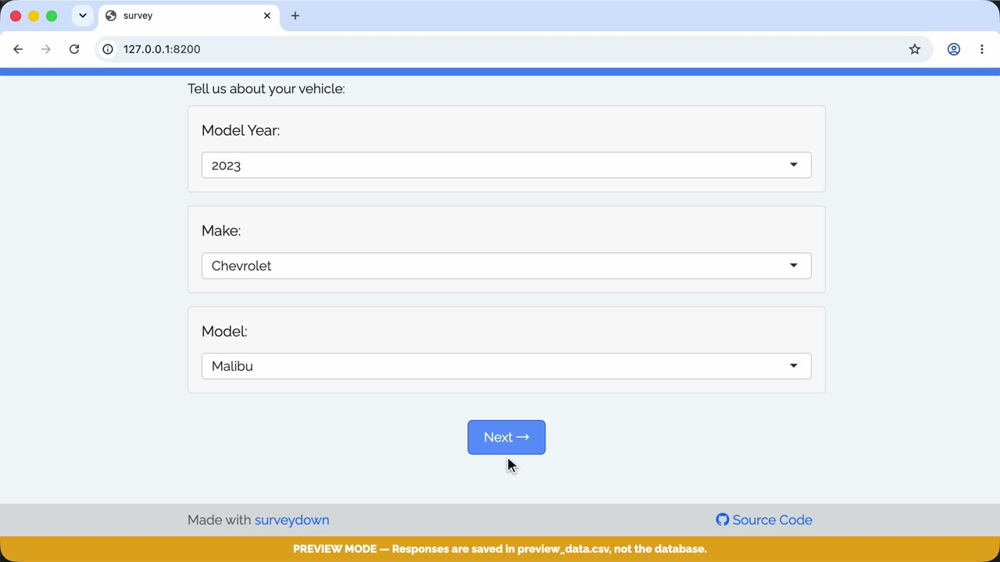

A reactive question template, with latter question options defined from former selection.

### 🎬 Walkthrough Recording

[](https://github.com/surveydown-dev/template_reactive_drilldown/blob/main/video-recording.mp4)

*Click the image above to play the recording.*

### Template page

https://surveydown.org/templates/reactive_drilldown

### Create this template

Run this command in your R console:

```r
surveydown::sd_create_survey(
  #path = "path/to/survey",
  template = "reactive_drilldown"
)
```

### Documentation

[Reactivity](https://surveydown.org/docs/reactivity.html) · [Start with a template](https://surveydown.org/docs/getting-started#start-with-a-template)
