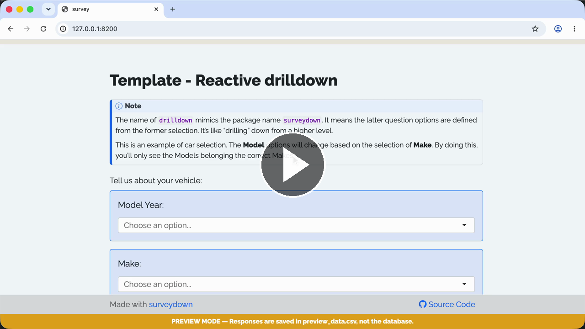

# Template - Reactive Drilldown

A reactive question template, with latter question options defined from former selection.

### See it in action

Play with the [**Live demo**](https://surveydown-reactive-drilldown.share.connect.posit.cloud) or watch the **Walkthrough recording:**

[](https://cdn.jsdelivr.net/gh/surveydown-dev/template_reactive_drilldown@main/video-recording.mp4)

### Create this template

Run this command in your R console:

```r
surveydown::sd_create_survey(
  #path = "path/to/survey",
  template = "reactive_drilldown"
)
```

### Learn more

- [Template page - Reactive Drilldown](https://surveydown.org/templates/reactive_drilldown)
- [Document page - Reactivity](https://surveydown.org/docs/reactivity.html)
- [Document page - Start with a template](https://surveydown.org/docs/getting-started#start-with-a-template)
